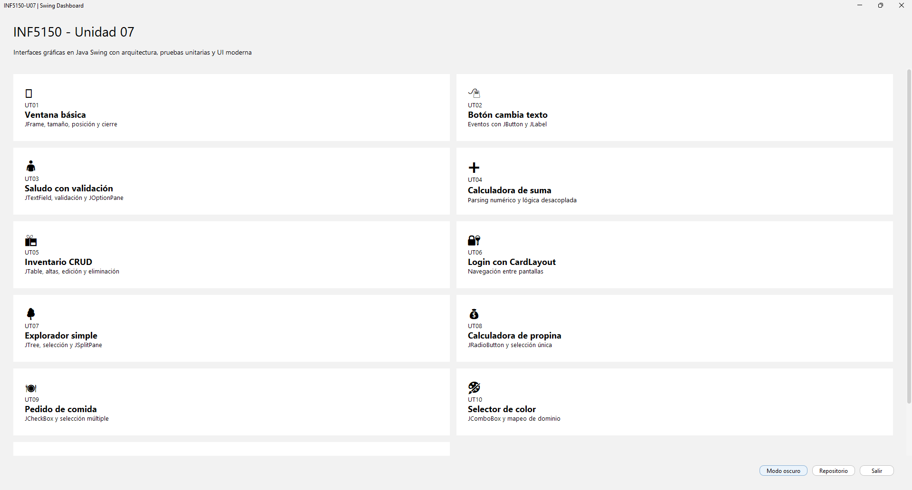
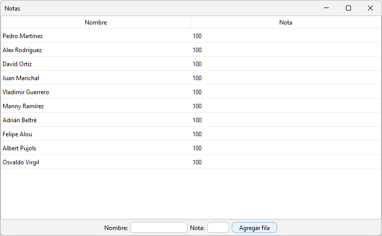
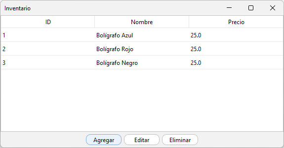
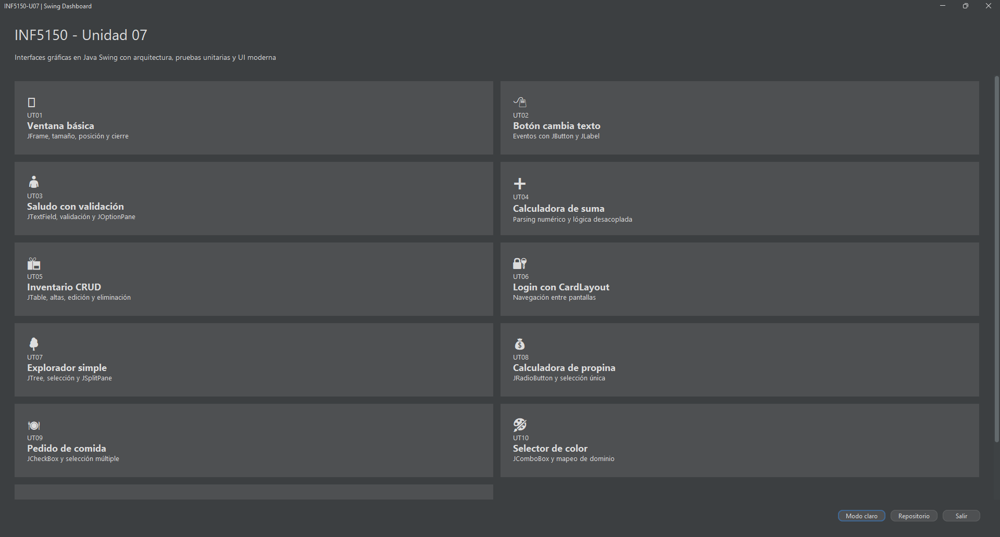

# INF5150 - Unidad 07  
## Interfaces gráficas en Java (Swing) con arquitectura y pruebas unitarias  


**Autor:** Edwin José Nolasco  

---

## 📌 Descripción

Este repositorio implementa la Unidad 07 de INF5150, enfocada en el desarrollo de interfaces gráficas en Java con Swing, incorporando principios fundamentales de arquitectura de software.

Incluye:

- separación UI / lógica de negocio  
- validación centralizada  
- servicios y entidades  
- pruebas unitarias (JUnit 5)  
- interfaz moderna con FlatLaf (modo claro/oscuro)  

---

## 🎥 Demo


---

## 🧠 Arquitectura

```
UI (Swing)
   ↓
Controladores (eventos)
   ↓
Servicios / Validadores
   ↓
Entidades / Datos
```

---

## 🎛️ Dashboard

Ejecutar:

```bash
mvn exec:java -Dexec.mainClass="ui.AppLauncher"
```

Características:

- dashboard centralizado  
- navegación entre ejercicios  
- modo claro/oscuro dinámico  
- UI moderna  

---

## 🖼️ Vista del sistema

### Dashboard


### Tabla de estudiantes


### Inventario


### Modo oscuro


---

## 📚 Contenidos

| Unidad | Tema |
|------|------|
| UT01 | Ventana básica |
| UT02 | Eventos |
| UT03 | Validación |
| UT04 | Cálculo |
| UT05 | CRUD |
| UT06 | Navegación |
| UT07 | Árbol |
| UT08 | RadioButton |
| UT09 | CheckBox |
| UT10 | ComboBox |
| UT11 | JTable |

---

## ⚙️ Tecnologías

- Java 24  
- Swing  
- Maven  
- JUnit 5  
- FlatLaf  

---

## 🧪 Pruebas

```bash
mvn test
```

Resultado esperado:

```
Tests run: 27, Failures: 0, Errors: 0
BUILD SUCCESS
```

---

## ▶️ Ejecución

```bash
mvn compile
mvn exec:java -Dexec.mainClass="ui.AppLauncher"
```

---

## ⚠️ Notas

- ventanas usan `DISPOSE_ON_CLOSE`  
- launcher controla ciclo de vida  
- lógica desacoplada de UI  

---

## 🎯 Conclusión

Este proyecto demuestra la transición desde interfaces básicas hacia una arquitectura estructurada, testeable y mantenible en Java.
